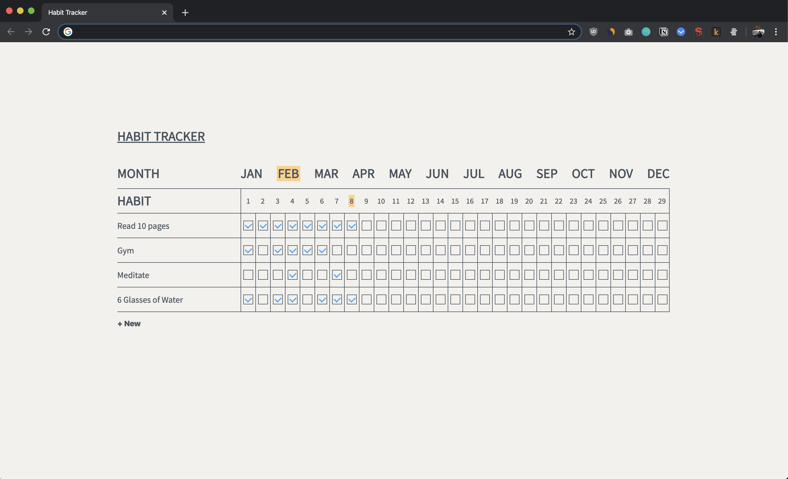

## Description

[Habit Tracker](https://chrome.google.com/webstore/detail/habit-tracker/ikcpbmlbgoknannnfcnfhmohpcnlphmn) is a very simple Chrome Extension that lets you add and keep track of your habits.  It displays a dashboard each time you open a new tab.  It is heavily inspired by book [Atomic Habits](https://www.goodreads.com/book/show/40121378-atomic-habits?ac=1&from_search=true&qid=EQmnI2AJUH&rank=1) by James Clear.

## Screenshot

  

## Edit Extension

1. Download zip.  

2. Go to chrome://extensions/ and enable Developer Mode.  

3. You can upload the folder and have fun modifying the code! 

## Contact
You can contact me [via email](mailto:teoladmann@gmail.com).

## Contributing
Habit Tracker was the Solo Project I chose to work while doing my Coding Bootcamp at [Codeworks](https://codeworks.me/).  There is a lot of room for improvement.  If you feel like it, you're more than welcome to contribute to the project.  Just fork the repository and submit a pull request.

## License
This project is licensed under the MIT License.
